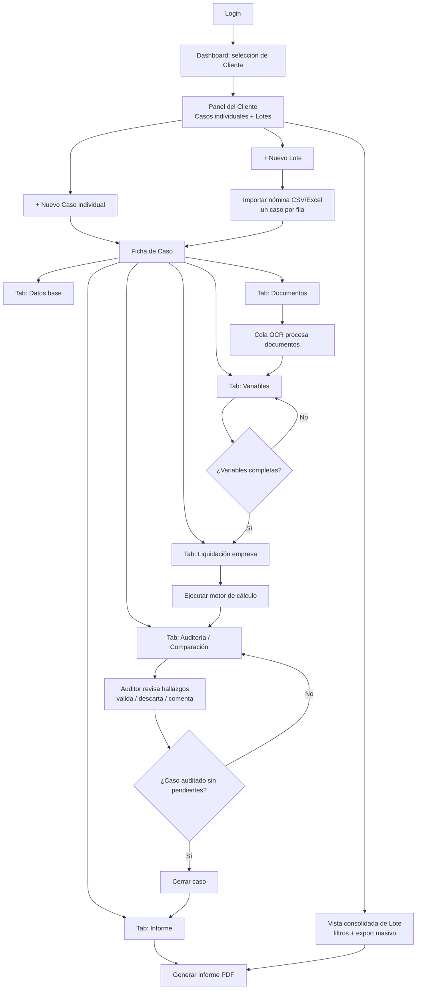

# Flujo de Usuario (UX/UI)

## 1. Mapa de navegación

## 2. Recorrido paso a paso

### Paso 1 — Selección de cliente
El usuario (auditor interno del estudio) elige el `Cliente` sobre el que va a trabajar desde un selector persistente en el header. Un `usuario` con rol `cliente_lectura` no ve este selector: entra directo al panel de su propio cliente.

### Paso 2 — Panel del cliente
Vista con dos secciones:
- **Casos individuales**: tabla de `Caso`s sueltos (no asociados a `Lote`), con columnas Empleado, Tipo de extinción, Fecha, Estado, Última auditoría.
- **Lotes**: tarjetas por `Lote` (nombre, motivo, cantidad de casos, % de casos con hallazgos de severidad alta).

Acciones: `+ Nuevo Caso`, `+ Nuevo Lote`. Filtros por estado (`borrador`, `en_revision`, `auditado`, `cerrado`).

### Paso 3 — Alta de caso
- **Individual**: formulario simple — datos del `Empleado` (o buscar uno existente por CUIL) + `tipo_extincion` + `fecha_extincion`.
- **Masivo (Lote)**: se crea el `Lote` (nombre + motivo) y luego se importa una planilla (CSV/Excel) con una fila por empleado: nombre, CUIL, fecha de ingreso, categoría, convenio, tipo de extinción, fecha de extinción. El sistema crea un `Caso` por fila y valida duplicados por CUIL antes de confirmar. Se muestra una previsualización con errores de formato resaltados antes de importar.

### Paso 4 — Ficha de caso (vista principal de trabajo)
Estructura en tabs, pensada para que el auditor pueda ir y volver sin perder contexto:

1. **Datos base**: datos del empleado y del caso (editable). Muestra el estado del caso como badge.
2. **Documentos**: zona de *drag & drop* para subir recibos de sueldo, telegramas, liquidación final presentada, CCT aplicable. Cada documento muestra su `estado_procesamiento` (pendiente/procesando/procesado/error) con polling o websocket sobre el resultado de la cola OCR. Al procesarse, se puede previsualizar el documento junto al texto extraído resaltando los campos detectados.
3. **Variables**: tabla editable de `Variable_Caso` (fecha de ingreso, mejor remuneración, días de vacaciones gozados, convenio aplicable, etc.). Las variables con `fuente = ocr` y `confianza` baja (ej. < 0.75) se resaltan en amarillo para revisión prioritaria del auditor; las cargadas manualmente se muestran en gris neutro. El auditor puede editar cualquier valor, y al hacerlo el sistema registra `fuente = manual` para ese campo.
4. **Liquidación empresa**: grilla para cargar (manual o pre-completada desde el documento "liquidación final") el monto que la empresa pagó por cada `Rubro`. Botón **"Ejecutar auditoría"** habilitado solo cuando las variables mínimas requeridas por el `tipo_extincion` están completas.
5. **Auditoría / Comparación**: el cuadro comparativo central (ver sección 3).
6. **Informe**: preview del informe final y botón de generación/descarga de PDF. Solo disponible cuando el caso está `cerrado` o `auditado`.

### Paso 5 — Ejecutar auditoría
Al presionar "Ejecutar auditoría": el backend corre el motor de cálculo con las `Variable_Caso` vigentes, genera una `Liquidacion` de origen `sistema` con sus `Liquidacion_Rubro`, crea una nueva `Auditoria` y calcula los `Hallazgo` comparando contra la `Liquidacion` de origen `empresa`. La UI navega automáticamente al tab de Comparación.

### Paso 6 — Comparación y hallazgos
Tabla con una fila por `Rubro`:

| Rubro | Declarado (empresa) | Calculado (sistema) | Diferencia | % | Severidad |
|---|---|---|---|---|---|
| Indemnización antigüedad | $ X | $ Y | $ (Y-X) | % | 🔴/🟡/🟢 |

- Severidad por umbral configurable (ej. alta si \|%\| > 10% o diferencia > cierto monto; media 3–10%; baja < 3%).
- Cada fila es expandible: muestra `detalle_calculo` (inputs y fórmula aplicada) para que el auditor entienda *por qué* el sistema llegó a ese número — clave para defender el hallazgo ante el cliente.
- El auditor puede marcar cada `Hallazgo` como `validado` (se confirma la diferencia, queda en el informe) o `descartado` (con comentario obligatorio — ej. "la empresa aplicó un adicional convencional no contemplado", útil para mejorar el motor de cálculo).
- Totalizador al pie: diferencia total en pesos y % sobre el total liquidado.

### Paso 7 — Cierre e informe
Cuando no quedan hallazgos `pendiente`, el auditor puede cerrar el caso (`estado = cerrado`). Se genera el `Informe` en PDF: encabezado del caso, cuadro comparativo, detalle de hallazgos validados, y anexo con la documentación de respaldo utilizada.

### Paso 8 — Vista consolidada de lote
Para un `Lote`: tabla con todos sus casos, columnas de estado y de diferencia total ($ y %), ordenable, con filtro por severidad. Botón "Exportar informe consolidado" que genera un único PDF/Excel con el resumen de todos los casos del lote — pensado para presentar al cliente el impacto económico agregado de una auditoría masiva.

## 3. Estados y validaciones de UX relevantes

- El botón "Ejecutar auditoría" queda deshabilitado (con tooltip explicando qué falta) si faltan variables obligatorias para el `tipo_extincion` del caso (ver tabla de aplicabilidad en `docs/motor-calculo.md`).
- Reprocesar un documento en estado `error` es una acción explícita (no automática) para no encolar reintentos infinitos sobre un archivo corrupto.
- Cualquier edición de una `Variable_Caso` después de haber ejecutado una auditoría dispara un aviso: "Esta variable cambió después de la última auditoría — los resultados pueden estar desactualizados", con acción directa a re-ejecutar (crea nueva `version` de `Liquidacion`, preservando el historial).
