# Modelo de Datos

## 1. Diagrama Entidad-Relación

```mermaid
erDiagram
    CLIENTE ||--o{ EMPLEADO : tiene
    CLIENTE ||--o{ LOTE : agrupa
    LOTE ||--o{ CASO : contiene
    CLIENTE ||--o{ USUARIO : "usuarios de"
    EMPLEADO ||--o{ CASO : protagoniza
    CASO ||--o{ DOCUMENTO : respalda
    CASO ||--o{ VARIABLE_CASO : define
    CASO ||--o{ LIQUIDACION : tiene
    CASO ||--o{ AUDITORIA : audita
    LIQUIDACION ||--o{ LIQUIDACION_RUBRO : detalla
    RUBRO ||--o{ LIQUIDACION_RUBRO : clasifica
    RUBRO ||--o{ HALLAZGO : clasifica
    AUDITORIA ||--o{ HALLAZGO : produce
    CASO ||--o{ INFORME : genera
    LOTE ||--o{ INFORME : genera

    CLIENTE {
        uuid id PK
        string razon_social
        string cuit
        string industria
        string contacto_email
        timestamp fecha_alta
    }
    USUARIO {
        uuid id PK
        uuid cliente_id FK "null si es usuario interno del estudio"
        string nombre
        string email
        string rol "admin | auditor | cliente_lectura"
    }
    EMPLEADO {
        uuid id PK
        uuid cliente_id FK
        string nombre
        string cuil
        date fecha_ingreso
        string categoria
        string convenio_colectivo
        string provincia
        numeric remuneracion_base
    }
    LOTE {
        uuid id PK
        uuid cliente_id FK
        string nombre
        string motivo "reestructuracion | despido_masivo | auditoria_periodica"
        timestamp fecha_creacion
    }
    CASO {
        uuid id PK
        uuid empleado_id FK
        uuid lote_id FK "null si es caso individual"
        string tipo_extincion "despido_sin_causa | despido_con_causa | renuncia | mutuo_acuerdo | vencimiento_contrato | fallecimiento"
        date fecha_extincion
        string estado "borrador | en_revision | auditado | cerrado"
        timestamp created_at
    }
    DOCUMENTO {
        uuid id PK
        uuid caso_id FK
        string tipo "recibo_sueldo | telegrama | liquidacion_final | cct | otro"
        string archivo_url
        string estado_procesamiento "pendiente | procesando | procesado | error"
        text texto_extraido
        jsonb metadata
        timestamp uploaded_at
    }
    VARIABLE_CASO {
        uuid id PK
        uuid caso_id FK
        string clave "fecha_ingreso | sueldo_bruto | dias_vacaciones_gozados | mejor_remuneracion | ..."
        string valor
        string fuente "manual | ocr | importado"
        numeric confianza "0-1, si viene de OCR"
        uuid documento_origen_id FK "nullable"
    }
    RUBRO {
        uuid id PK
        string codigo "IND_ANTIGUEDAD | PREAVISO | INTEGRACION_MES | SAC_PROP | VAC_NO_GOZADAS | SAC_S_VAC | (más conceptos variables por cliente)"
        string nombre
        string base_legal
        boolean activo
    }
    LIQUIDACION {
        uuid id PK
        uuid caso_id FK
        string origen "empresa | sistema"
        int version
        date fecha_liquidacion
        string estado "vigente | reemplazada"
        timestamp created_at
    }
    LIQUIDACION_RUBRO {
        uuid id PK
        uuid liquidacion_id FK
        uuid rubro_id FK
        numeric monto
        jsonb detalle_calculo "inputs y fórmula aplicada, para trazabilidad"
    }
    AUDITORIA {
        uuid id PK
        uuid caso_id FK
        uuid usuario_id FK
        timestamp fecha
        string estado "ok | con_diferencias | requiere_revision"
        text resumen
    }
    HALLAZGO {
        uuid id PK
        uuid auditoria_id FK
        uuid rubro_id FK
        numeric monto_declarado
        numeric monto_calculado
        numeric diferencia "calculado - declarado"
        numeric porcentaje_diferencia
        string severidad "alta | media | baja"
        string estado "pendiente | validado | descartado"
        text comentario
    }
    INFORME {
        uuid id PK
        uuid caso_id FK "nullable si es informe de lote"
        uuid lote_id FK "nullable si es informe de caso individual"
        string formato "pdf"
        string archivo_url
        timestamp fecha_generacion
    }
```



## 2. Notas de diseño por entidad

- **`Cliente`**: la empresa contratante de la auditoría. Todo dato de negocio cuelga, directa o indirectamente, de un `cliente_id`.
- **`Empleado`**: datos "estables" del trabajador (los que no cambian por el tipo de extinción). Un mismo empleado no debería tener más de un `Caso` activo simultáneo, pero se modela 1:N por si se re-audita un caso cerrado.
- **`Lote`**: agrupador opcional. Un despido masivo o una auditoría periódica crea un `Lote` y le cuelgan N `Caso`s; el informe de lote consolida los hallazgos de todos sus casos.
- **`Caso`**: la unidad central de trabajo — "esta persona, con esta fecha y tipo de extinción, hay que auditar". Tiene estado propio de flujo (`borrador → en_revision → auditado → cerrado`).
- **`Documento`**: archivo original subido (PDF/Excel/imagen). Se procesa asíncronamente (cola OCR) y su resultado (`texto_extraido`, `metadata`) alimenta `Variable_Caso`. Nunca se descarta: es el respaldo legal de la auditoría.
- **`Variable_Caso`**: patrón clave-valor (EAV) deliberado — las variables necesarias para calcular varían según convenio/tipo de extinción, y necesitamos poder marcar **origen y confianza** de cada una para que el auditor revise primero lo que vino de OCR con baja confianza. Alternativa más rígida (columnas fijas en `Caso`) se descartó por baja flexibilidad ante convenios distintos.
- **`Rubro`**: catálogo maestro de conceptos liquidables (tabla de referencia, poco volumen, editable por un admin legal sin tocar código — importante porque la legislación cambia).
- **`Liquidacion`**: **siempre existen (al menos) dos por caso**: origen `empresa` (lo que la empresa efectivamente pagó/presentó, cargado desde el documento o manualmente) y origen `sistema` (lo que el motor de cálculo produce). Versionado (`version`) permite recalcular si se corrige una variable base sin perder el historial.
- **`Liquidacion_Rubro`**: el detalle por concepto de cada liquidación. `detalle_calculo` (JSONB) guarda qué fórmula y qué inputs se usaron — clave para que el informe explique *por qué* el sistema calculó ese monto.
- **`Auditoria`**: el acto de comparar una `Liquidacion` `empresa` contra su par `sistema` para un caso. Genera N `Hallazgo`.
- **`Hallazgo`**: una fila del cuadro comparativo — por rubro, declarado vs. calculado, diferencia, severidad. Es la entidad que alimenta el "Módulo de Comparación" de la UI.
- **`Informe`**: documento final exportable (PDF), a nivel caso o a nivel lote (consolidado).

## 3. DDL de referencia (PostgreSQL, simplificado)

```sql
CREATE TABLE cliente (
    id              uuid PRIMARY KEY DEFAULT gen_random_uuid(),
    razon_social    text NOT NULL,
    cuit            text NOT NULL UNIQUE,
    industria       text,
    contacto_email  text,
    fecha_alta      timestamptz NOT NULL DEFAULT now()
);

CREATE TABLE usuario (
    id          uuid PRIMARY KEY DEFAULT gen_random_uuid(),
    cliente_id  uuid REFERENCES cliente(id),
    nombre      text NOT NULL,
    email       text NOT NULL UNIQUE,
    rol         text NOT NULL CHECK (rol IN ('admin','auditor','cliente_lectura')),
    created_at  timestamptz NOT NULL DEFAULT now()
);

CREATE TABLE empleado (
    id                  uuid PRIMARY KEY DEFAULT gen_random_uuid(),
    cliente_id          uuid NOT NULL REFERENCES cliente(id),
    nombre              text NOT NULL,
    cuil                text NOT NULL,
    fecha_ingreso       date NOT NULL,
    categoria           text,
    convenio_colectivo  text,
    provincia           text,
    remuneracion_base   numeric(14,2),
    UNIQUE (cliente_id, cuil)
);

CREATE TABLE lote (
    id              uuid PRIMARY KEY DEFAULT gen_random_uuid(),
    cliente_id      uuid NOT NULL REFERENCES cliente(id),
    nombre          text NOT NULL,
    motivo          text CHECK (motivo IN ('reestructuracion','despido_masivo','auditoria_periodica')),
    fecha_creacion  timestamptz NOT NULL DEFAULT now()
);

CREATE TABLE caso (
    id              uuid PRIMARY KEY DEFAULT gen_random_uuid(),
    empleado_id     uuid NOT NULL REFERENCES empleado(id),
    lote_id         uuid REFERENCES lote(id),
    tipo_extincion  text NOT NULL CHECK (tipo_extincion IN
                        ('despido_sin_causa','despido_con_causa','renuncia',
                         'mutuo_acuerdo','vencimiento_contrato','fallecimiento')),
    fecha_extincion date NOT NULL,
    estado          text NOT NULL DEFAULT 'borrador'
                        CHECK (estado IN ('borrador','en_revision','auditado','cerrado')),
    created_at      timestamptz NOT NULL DEFAULT now()
);

CREATE TABLE documento (
    id                      uuid PRIMARY KEY DEFAULT gen_random_uuid(),
    caso_id                 uuid NOT NULL REFERENCES caso(id),
    tipo                    text NOT NULL CHECK (tipo IN
                                ('recibo_sueldo','telegrama','liquidacion_final','cct','otro')),
    archivo_url             text NOT NULL,
    estado_procesamiento    text NOT NULL DEFAULT 'pendiente'
                                CHECK (estado_procesamiento IN ('pendiente','procesando','procesado','error')),
    texto_extraido          text,
    metadata                jsonb,
    uploaded_at             timestamptz NOT NULL DEFAULT now()
);

CREATE TABLE variable_caso (
    id                  uuid PRIMARY KEY DEFAULT gen_random_uuid(),
    caso_id             uuid NOT NULL REFERENCES caso(id),
    clave               text NOT NULL,
    valor               text NOT NULL,
    fuente              text NOT NULL CHECK (fuente IN ('manual','ocr','importado')),
    confianza           numeric(3,2),
    documento_origen_id uuid REFERENCES documento(id),
    UNIQUE (caso_id, clave)
);

CREATE TABLE rubro (
    id          uuid PRIMARY KEY DEFAULT gen_random_uuid(),
    codigo      text NOT NULL UNIQUE,
    nombre      text NOT NULL,
    base_legal  text,
    activo      boolean NOT NULL DEFAULT true
);

CREATE TABLE liquidacion (
    id                  uuid PRIMARY KEY DEFAULT gen_random_uuid(),
    caso_id             uuid NOT NULL REFERENCES caso(id),
    origen              text NOT NULL CHECK (origen IN ('empresa','sistema')),
    version             int NOT NULL DEFAULT 1,
    fecha_liquidacion   date,
    estado              text NOT NULL DEFAULT 'vigente' CHECK (estado IN ('vigente','reemplazada')),
    created_at          timestamptz NOT NULL DEFAULT now()
);

CREATE TABLE liquidacion_rubro (
    id                  uuid PRIMARY KEY DEFAULT gen_random_uuid(),
    liquidacion_id      uuid NOT NULL REFERENCES liquidacion(id),
    rubro_id            uuid NOT NULL REFERENCES rubro(id),
    monto               numeric(14,2) NOT NULL,
    detalle_calculo     jsonb
);

CREATE TABLE auditoria (
    id          uuid PRIMARY KEY DEFAULT gen_random_uuid(),
    caso_id     uuid NOT NULL REFERENCES caso(id),
    usuario_id  uuid REFERENCES usuario(id),
    fecha       timestamptz NOT NULL DEFAULT now(),
    estado      text NOT NULL CHECK (estado IN ('ok','con_diferencias','requiere_revision')),
    resumen     text
);

CREATE TABLE hallazgo (
    id                      uuid PRIMARY KEY DEFAULT gen_random_uuid(),
    auditoria_id            uuid NOT NULL REFERENCES auditoria(id),
    rubro_id                uuid NOT NULL REFERENCES rubro(id),
    monto_declarado         numeric(14,2) NOT NULL,
    monto_calculado         numeric(14,2) NOT NULL,
    diferencia              numeric(14,2) GENERATED ALWAYS AS (monto_calculado - monto_declarado) STORED,
    porcentaje_diferencia   numeric(6,2),
    severidad               text CHECK (severidad IN ('alta','media','baja')),
    estado                  text NOT NULL DEFAULT 'pendiente'
                                CHECK (estado IN ('pendiente','validado','descartado')),
    comentario              text
);

CREATE TABLE informe (
    id                  uuid PRIMARY KEY DEFAULT gen_random_uuid(),
    caso_id             uuid REFERENCES caso(id),
    lote_id             uuid REFERENCES lote(id),
    formato             text NOT NULL DEFAULT 'pdf',
    archivo_url         text NOT NULL,
    fecha_generacion    timestamptz NOT NULL DEFAULT now(),
    CHECK (caso_id IS NOT NULL OR lote_id IS NOT NULL)
);
```

## 4. Próximos pasos de modelado

- Definir catálogo inicial de `Rubro` (mínimo viable: indemnización por antigüedad, preaviso, integración mes de despido, SAC proporcional, vacaciones no gozadas, SAC s/vacaciones). El cálculo de multas (art. 1/2 Ley 25.323, art. 80 LCT) se dio de baja del motor — ver docs/motor-calculo.md §4.
- Tabla de **parámetros normativos versionados** (topes indemnizatorios, RIPTE, índices) separada de `Rubro`, para que el motor de cálculo lea valores vigentes a la `fecha_extincion` del caso — se documentará junto al motor de cálculo.
- Definir política de reintento/errores para `Documento` en estado `error` (reprocesamiento manual vs. automático).
